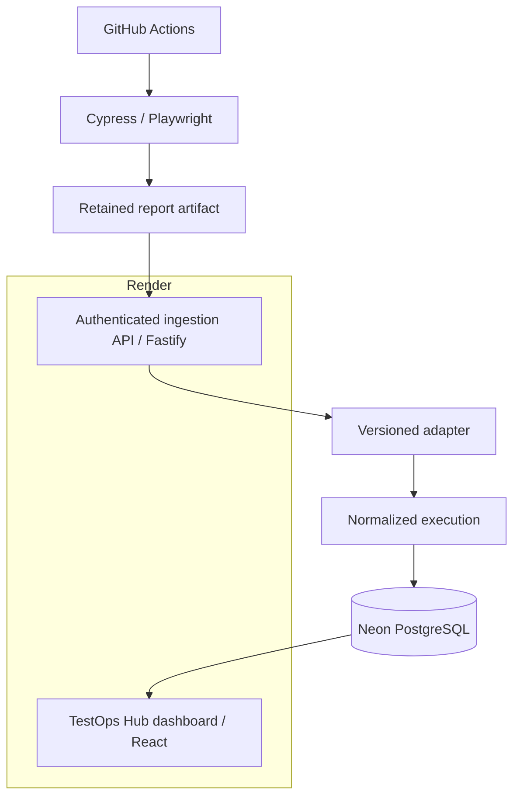

# TestOps Hub

**From CI test execution to actionable quality insights.**

TestOps Hub is a portfolio TestOps platform that collects automated test reports from CI pipelines and turns them into centralized execution history, quality metrics and regression insights.

**Live Demo:** [qualityops-hub.onrender.com](https://qualityops-hub.onrender.com)<br>
**Architecture:** React + Fastify on Render, PostgreSQL on Neon, browser automation in GitHub Actions<br>
**CI Status:** [](https://github.com/luanaabastos/testops-hub/actions/workflows/platform.yml)

[`v1.0.0`](https://github.com/luanaabastos/testops-hub/releases/tag/v1.0.0) · [MIT](LICENSE) · Node.js `20.20.1` · pnpm `10.34.5`

> Every product, user, test, execution and metric in this project is fictional and synthetic. The linked CI workflows, browser runs, reports, ingestion and persistence are real portfolio evidence.

## What problem does it solve?

Automated-test evidence is often split across:

- GitHub Actions jobs;
- report artifacts;
- framework-specific output;
- logs;
- older executions.

Instead of checking multiple pipelines and reports manually, TestOps Hub provides one consolidated view of test quality. It makes it easier to answer what ran, what failed, whether a regression is new and where the evidence came from.

## How it works

```text
CI Pipeline
↓
Automated Tests
↓
Test Reports
↓
TestOps Hub
↓
History + Metrics + Regression Signals
```

GitHub Actions runs Cypress and Playwright in real browsers and retains their reports as artifacts. An authenticated Fastify API validates each report, selects a versioned adapter and stores one normalized execution in Neon PostgreSQL. The React dashboard then presents history, metrics and Regression Delta.

## Real CI Evidence

These workflows are public proof. Each one ran real browser automation, preserved its framework report and ingested the result into the hosted API.

| Scenario | Framework | Executed | Passed | Failed | Workflow | Artifact | Dashboard execution |
|---|---|---:|---:|---:|---|---|---|
| ShopSphere — success | Cypress / Mochawesome | 5 | 5 | 0 | [Run 32431118788](https://github.com/luanaabastos/testops-hub/actions/runs/32431118788) | [Mochawesome report](https://github.com/luanaabastos/testops-hub/actions/runs/32431118788/artifacts/9429101193) | [Execution](https://qualityops-hub.onrender.com/executions/a8a65b5d-17b2-4714-b3c1-d2192b945963) |
| ServiceDesk — success | Playwright / JSON | 5 | 5 | 0 | [Run 32431321053](https://github.com/luanaabastos/testops-hub/actions/runs/32431321053) | [Playwright report](https://github.com/luanaabastos/testops-hub/actions/runs/32431321053/artifacts/9429173727) | [Execution](https://qualityops-hub.onrender.com/executions/6899dec4-d7d6-4fe9-ba89-7edf30b88d1c) |
| ShopSphere — functional failure | Cypress / Mochawesome | 5 | 4 | 1 | [Expected failed run 32431559619](https://github.com/luanaabastos/testops-hub/actions/runs/32431559619) | [Mochawesome report](https://github.com/luanaabastos/testops-hub/actions/runs/32431559619/artifacts/9429251422) | [Execution](https://qualityops-hub.onrender.com/executions/af12fdee-6860-4916-a35c-9fce60022556) |

The functional-failure workflow finishes red only after its report is uploaded and ingested. The official dashboard aggregate is **10 executed, 9 passed, 1 failed, 0 infrastructure errors, 90% Approval Rate and a 90% Quality Score**.

## Demo vs Official Evidence

| Label | Meaning | Affects official metrics? |
|---|---|---|
| **Official CI** | Real Cypress or Playwright browser tests executed by GitHub Actions and ingested into the platform. | Yes |
| **Hosted Preview** | A safe hosted demonstration of the ingestion stages. It starts no browser and creates no execution. | No |
| **Demo Data** | Synthetic history and planning data used only to explain parts of the interface. | No |
| **Local Demo** | Allow-listed local runners used during development and validation. | No |

PocketWallet is explicitly a deterministic **Mobile Harness Demo**, not a real Android or Appium run.

## Architecture



Browser automation stays in GitHub Actions because the hosted free tier serves the application and API rather than browser-heavy workers. The dashboard and API share the same Render origin.

## Features

- Normalization for Mochawesome, Playwright JSON and `mobile-e2e-json-v1` reports.
- Product-scoped authenticated ingestion.
- Idempotent replay and HTTP 409 for conflicting content at the same identity.
- Traceable execution history with workflow, job, artifact, branch and commit metadata.
- Approval Rate, Quality Score, freshness and explicit infrastructure-error semantics.
- Regression Delta for new, recovered, persistent, added and removed tests.
- **Automation Coverage** for mapped quality scenarios; it is not code coverage.
- Execution Details with sanitized diagnostics.
- Pipeline Lab with allow-listed local runners and a separate Hosted Preview mode.
- Health and readiness endpoints.
- Responsive, keyboard-accessible portfolio UI.

## Engineering Decisions

- **Versioned adapters:** framework parsing stays separate from HTTP routes and domain metrics.
- **Normalized execution model:** different report formats remain comparable without losing traceability.
- **Product-scoped tokens:** each integration is restricted to its own fictional product.
- **Idempotency:** CI retries return the original execution; conflicting content is rejected.
- **External CI for browsers:** GitHub Actions runs real Cypress and Playwright while Render hosts the UI and API.
- **Preview is not evidence:** Hosted Preview demonstrates state transitions but cannot change official metrics.
- **Stable internal names:** package scopes, environment variables, database names and the hosted URL retain `qualityops` identifiers to avoid an unrelated migration during the public product and repository rename.

## Limitations

- PocketWallet is a deterministic Mobile Harness Demo, not a real device run.
- Render Free may introduce a cold start.
- Object storage is not enabled; GitHub Actions retains external-CI reports.
- There is no user authentication, role model or multi-tenancy.
- Background demo jobs use an in-process queue without distributed recovery.
- Video Evidence is a clearly labeled concept preview without stored recordings.
- The hosted URL and stable internal identifiers still use `qualityops-hub`; they do not change the public TestOps Hub product or repository identity.

## Live Demo

[https://qualityops-hub.onrender.com](https://qualityops-hub.onrender.com)

- All products and displayed data are fictional.
- Real Cypress and Playwright evidence comes from the linked GitHub Actions workflows.
- Neon PostgreSQL persists normalized execution history.
- Hosted Preview does not run browsers or create official evidence.
- Render Free may need a cold start before the first response.

## Screenshots

| Overview | Pipeline Lab |
|---|---|
|  |  |

| Executions | Regression Delta |
|---|---|
|  |  |

| Automation Coverage | Integrations |
|---|---|
|  |  |

## Security

- Raw integration tokens are shown once; PostgreSQL stores salted scrypt hashes.
- Report bodies are bounded and schema-validated; SQL calls are parameterized and ingestion is transactional.
- Pipeline Lab accepts mapped enums and never builds arbitrary commands or paths.
- Diagnostics are sanitized before persistence.
- Public-release scans cover corporate references, secrets, history, paths, assets and Git identities.

See [SECURITY.md](SECURITY.md) and the [security design notes](docs/security.md).

## Getting started

### Prerequisites

- Node.js `20.20.1`
- pnpm `10.34.5`
- Docker with Compose

```bash
pnpm install --frozen-lockfile
pnpm demo:start
pnpm demo:status
```

Open `http://localhost:5173`. Stop only the project services with `pnpm demo:stop`.

## Validation

```bash
pnpm lint
pnpm typecheck
pnpm test
pnpm build
pnpm test:e2e
pnpm test:production
pnpm test:hosted-preview
pnpm scan:references
pnpm scan:secrets
pnpm scan:public
```

## Documentation

- [How the architecture works](docs/architecture.md)
- [Report adapters](docs/adapters.md)
- [Report contract](docs/test-report-contract.md)
- [GitHub Actions ingestion](docs/github-actions.md)
- [Hosting](docs/hosting.md)
- [Security](docs/security.md)
- [Public rename decision](docs/branding/testops-hub-rename.md)
- [Portfolio case study](docs/portfolio/case-study.md)
- [Public evidence index](docs/portfolio/evidence-index.md)
- [LinkedIn launch — PT-BR](docs/portfolio/linkedin-launch-pt.md)
- [LinkedIn launch — English](docs/portfolio/linkedin-launch-en.md)
- [Historical v1.0.0 release notes](docs/releases/v1.0.0.md)
- [Prepared v1.1.0 release notes](docs/releases/v1.1.0.md)

## License and disclaimer

TestOps Hub is available under the [MIT License](LICENSE).

TestOps Hub is an independent portfolio project. ShopSphere, ServiceDesk, PocketWallet, their users, tests, pipelines and all displayed data are fictional and synthetic. No real organization, proprietary product, enterprise system, client or employer integration is represented.
